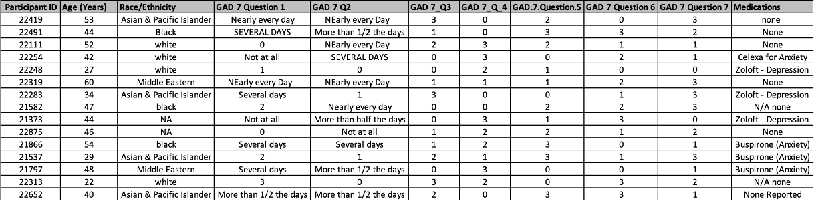

# Day 3 - Text manipulation with R (case study example from slides)

- Clone this repository or download it directly to your computer
- Includes R project with R script and dataset for case study example in slides
  -  Open the project in R studio.
  -  Open `cleaning-text-data-case-study.R` and start running the code!

## Case study - the messy data in question 😔

